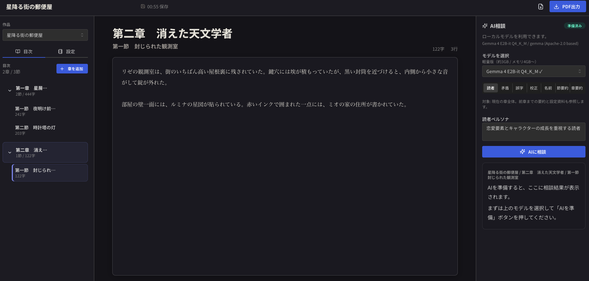

# 言の葉

ローカルLLMで小説執筆を支援する、デスクトップエディタです。

本文、設定資料、章構成、AIへの相談をひとつの画面にまとめ、作品づくりの流れを止めずに書けることを目指しています。文章や設定はローカルに保存され、外部サービスへ送信されません。



## 主な機能

- 作品、章、節を管理できる小説エディタ
- SQLiteによる自動保存
- 目次から任意の章・節へ移動
- キャラクター、街・場所、作品メモの設定資料パネル
- PDF出力
- ローカルLLMによるAI相談
  - 読者フィードバック
  - 矛盾チェック
  - 誤字脱字チェック
  - 校正
  - 名前候補
  - 節要約、章要約
- 誤字脱字・校正提案のハイライトと本文への適用

## AIモデル

アプリ内の「AIを準備」ボタンから、GGUF形式のGemma 4モデルをダウンロードして使います。

| モデル | 用途 | 目安サイズ | 目安メモリ |
|---|---|---:|---:|
| Gemma 4 E2B-it Q4_K_M | 軽量 | 約3GB | 4GB以上 |
| Gemma 4 E4B-it Q4_K_M | 標準 | 約3.5GB | 8GB以上 |
| Gemma 4 26B-A4B-it UD-Q4_K_M | 高品質 | 約17GB | 16GB以上 |

モデルはHugging Face上のUnsloth GGUF配布元から取得します。モデルの利用条件は各配布元・元モデルのライセンスを確認してください。
モデルファイルはリポジトリには含めません。アプリ内操作で各ユーザーの環境へダウンロードされます。

## 使い方

### デスクトップアプリとして起動

開発環境では次のコマンドでTauriアプリを起動できます。

```bash
npm install
npm run tauri:dev
```

初回はPythonバックエンドのsidecar生成とRust依存のビルドが走るため、少し時間がかかります。

ビルドする場合:

```bash
npm run tauri:build -- --debug
```

macOSのデバッグ版アプリは次に生成されます。

```text
src-tauri/target/debug/bundle/macos/言の葉.app
```

Tauri版はPythonバックエンドをsidecar実行ファイルとして同梱するため、生成済みのアプリを使う人が `uv` やPythonを直接操作する必要はありません。

### Web開発モード

ブラウザで開発する場合:

```bash
npm install
npm run dev
```

フロントエンドは `http://127.0.0.1:5173/`、バックエンドAPIは `http://127.0.0.1:8765/` で起動します。

## データ保存場所

Web開発モードでは、作品データとモデルはプロジェクト直下に保存されます。

- 作品データ: `data/novel_assistant.sqlite`
- モデル: `models/`

Tauri版では、OSのアプリデータ領域に保存されます。文章や設定は外部サービスに送信されません。

## 開発

### 必要なもの

- Node.js
- Rust / Cargo
- uv

### よく使うコマンド

```bash
npm run lint
npm run build
npm run build:backend
cargo check --manifest-path src-tauri/Cargo.toml
PYTHONPYCACHEPREFIX=/tmp/novel-assistant-pycache python3 -m compileall backend
```

### デモデータ

スクリーンショット用のデモ作品を作る場合:

```bash
npm run seed:demo
```

既存の `data/novel_assistant.sqlite` は上書きされます。

## 技術スタック

- Frontend: React, TypeScript, Mantine, Tailwind CSS, Vite
- Desktop: Tauri v2
- Backend: Python, SQLite, llama-cpp-python
- Package manager: npm, uv
- Lint / type check: TypeScript, ruff / pyright想定

## ライセンス

Apache License 2.0
